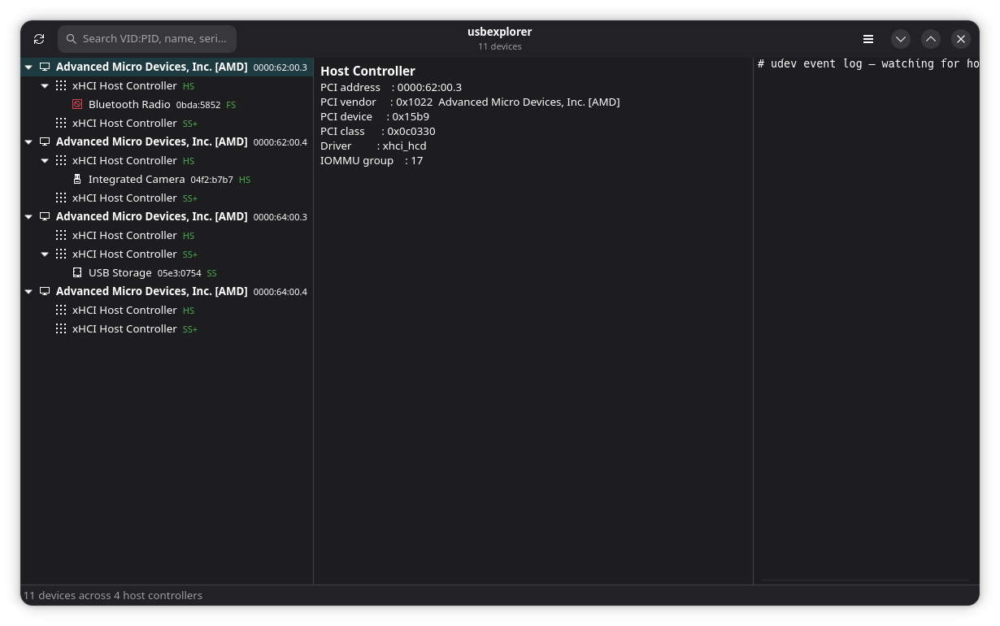

# usbexplorer

A feature-complete, open-source Linux reimplementation of
[USB Device Tree Viewer](https://www.uwe-sieber.de/usbtreeview_e.html) V4.7.2 by Uwe Sieber.

Written in pure C11 with a shared, UI-agnostic backend driving three frontends:

- a non-interactive **CLI** (`--list`, `--tree`, `--json`, `--xml`, …),
- a full-featured **ncurses TUI**,
- a **GTK4 / libadwaita GUI**,

plus Linux-native extras: udev rule generation, power-management tuning, usbmon packet
capture, a SQLite device-history audit log, filtered dmesg, and read-speed testing.



```
$ usbexplorer --tree
Host Controller 0000:62:00.3  xhci_hcd  [1022:15b9]  Advanced Micro Devices, Inc. [AMD]
├─ usb1  Linux 6.18 xHCI Host Controller  [HS]
│  └─ Port 5: Realtek Bluetooth Radio  0bda:5852  [FS]
└─ usb2  Linux 6.18 xHCI Host Controller  [SS+]
```

## Status

Under active construction. The shared backend (sysfs + libusb enumeration, full
descriptor decode), the complete CLI, the ncurses TUI, and the GTK4 GUI are all
implemented, along with udev rules, power-management toggles, a SQLite history
log, device diff, theming, and session persistence.

## Building

```sh
meson setup build
ninja -C build
./build/src/usbexplorer --tree
sudo meson install -C build   # binary, man page, .desktop, icon, completions
```

### Build options

| Option       | Default | Description                          |
|--------------|---------|--------------------------------------|
| `-Dgui`      | auto    | GTK4 GUI frontend                    |
| `-Dtui`      | auto    | ncurses TUI frontend                 |
| `-Dhistory`  | auto    | SQLite device history / audit log    |
| `-Dusbmon`   | auto    | usbmon packet capture                |

## CLI usage

```
usbexplorer --list                  one line per device
usbexplorer --gui                   GTK4 / libadwaita graphical interface
usbexplorer --tui                   interactive ncurses TUI (see below)
usbexplorer --tree [-i]             ASCII topology tree (-i shows interfaces)
usbexplorer --json [--compact]      full decoded descriptor tree (JSON)
usbexplorer --xml                   XML report
usbexplorer --device VID:PID        filter to matching device(s)
            [--serial SERIAL]
usbexplorer --watch                 stream hotplug events as JSON lines
usbexplorer --udev-rule VID:PID     print a udev rule for a device
usbexplorer --dmesg BUSNUM.DEVNUM   kernel-log lines for a device (needs root)
usbexplorer --speed-test BUSNUM.DEVNUM   sequential read speed (storage; needs root)
usbexplorer --reset-device BUSNUM.DEVNUM     reset (USBDEVFS_RESET) — needs root
usbexplorer --restart-device BUSNUM.DEVNUM   unbind+rebind driver  — needs root
usbexplorer --port-cycle BUSNUM.DEVNUM       de/re-authorise       — needs root
usbexplorer --autosuspend on|off:BUSNUM.DEVNUM   toggle autosuspend — needs root
usbexplorer --wakeup on|off:BUSNUM.DEVNUM        toggle remote-wakeup — needs root
usbexplorer --diff A,B              descriptor diff of two devices (bus.dev / vid:pid)
usbexplorer --latency BUSNUM.DEVNUM interrupt/isoch endpoint poll-rate analysis
usbexplorer --history               connect/disconnect audit log (SQLite)
usbexplorer --history-csv           audit log as CSV
usbexplorer --bluetooth             list Bluetooth adapters/devices (BlueZ)
usbexplorer --bt-remove MAC         forget a Bluetooth device
usbexplorer --usbmon BUSNUM[.DEVNUM]   live usbmon text capture (needs root)
usbexplorer --usbmon-pcap BUSNUM:FILE  capture usbmon packets to a pcap file
```

**Bluetooth** uses the BlueZ D-Bus API. **usbmon** capture requires the
`usbmon` kernel module (`modprobe usbmon`) and debugfs; it degrades gracefully
with a clear message when unavailable. The **GUI** primary menu adds *Compare devices…* (descriptor diff),
*Bluetooth devices…* (BlueZ panel with a Forget action), and *Save tree as
PNG…* (renders the tree widget to an image).

Per-device **power management** (autosuspend control, autosuspend delay, remote
wakeup, runtime status) is read from sysfs and shown in `--json` and the
TUI/GUI detail panes; the GUI right-click menu can toggle it via `pkexec`. The
**audit log** is populated while `--watch` (or the GUI) runs, stored under
`$XDG_DATA_HOME/usbexplorer/history.db`.

The `--reset-device` / `--restart-device` / `--port-cycle` subcommands are what
the GUI runs through `pkexec`; they also work standalone under `sudo`.

`--json`/`--xml`/`--list`/`--tree` also surface a BadUSB / device-hygiene
heuristic (composite keyboard + storage/network, missing serial, etc.); flagged
devices are marked `[!]`/`[*]` in `--list`/`--tree` and carry a `warnings` array
in `--json`. Privileged actions degrade gracefully to a clear message when run
without the necessary permissions.

## GUI

`usbexplorer --gui` opens a three-pane GTK4 / libadwaita window:

- **left** — the device tree (`GtkListView` + `GtkTreeListModel`) with per-class
  icons, colour-coded speed badges, and ⚠ markers on devices with BadUSB findings;
- **centre** — a detail pane with the summary, interfaces, warnings, and the full
  decoded descriptor tree;
- **right** — a live udev event log (collapsible via the header-bar toggle) that
  also auto-refreshes the tree on hotplug.

The udev monitor's file descriptor is bridged onto the GLib main loop, so hotplug
events arrive without a worker thread. A header-bar **Refresh** button
re-enumerates on demand.

Also in the GUI:

- **Search** (header) — type a VID:PID, name, serial, or sysfs name to jump to a device.
- **Right-click a device** — Copy info, Copy udev rule, Search online, Open sysfs
  folder; Diagnostics (read speed, dmesg, interrupt latency); power toggles; and
  (via `pkexec`) Reset / Restart / Power-cycle.
- **Themes** — a primary-menu palette picker (Default, Dark, Nord, Solarized,
  Catppuccin, High-Contrast) plus System/Light/Dark colour scheme.
- **Hotplug notifications** (libnotify), toggleable.
- **Session persistence** — window size, pane split, theme, scheme, and toggles are
  saved to `~/.config/usbexplorer/settings.ini`.

## TUI

`usbexplorer --tui` opens a two-pane, keyboard-driven interface (left: device
tree, right: scrollable detail with full descriptor decode). Colour-coded speed
badges, controller rows, and BadUSB warnings.

| Key | Action |
|-----|--------|
| `j`/`k`/arrows | move selection / scroll |
| `h`/`l` | collapse / expand (or go to parent / first child) |
| `Enter` | toggle expand |
| `g`/`G`, `PgUp`/`PgDn` | first/last, page |
| `Tab` | switch focus between tree and detail |
| `/`, `n`/`N` | search (VID:PID, name, serial, driver, sysfs…), next/prev |
| `:` | command mode — `interfaces` `expand` `collapse` `refresh`; per-device `dmesg` `latency` `speedtest` `bluetooth` `history` `reset` `restart` `portcycle` `autosuspend on\|off` `wakeup on\|off` `online` `open` |
| `i` | toggle interface rows |
| `u` | show generated udev rule for the selected device |
| `?` | keybinding help · `q` quit |

Mouse: click to select, wheel to scroll the focused pane.

## License

GPL-2.0-or-later. See [LICENSE](LICENSE).
